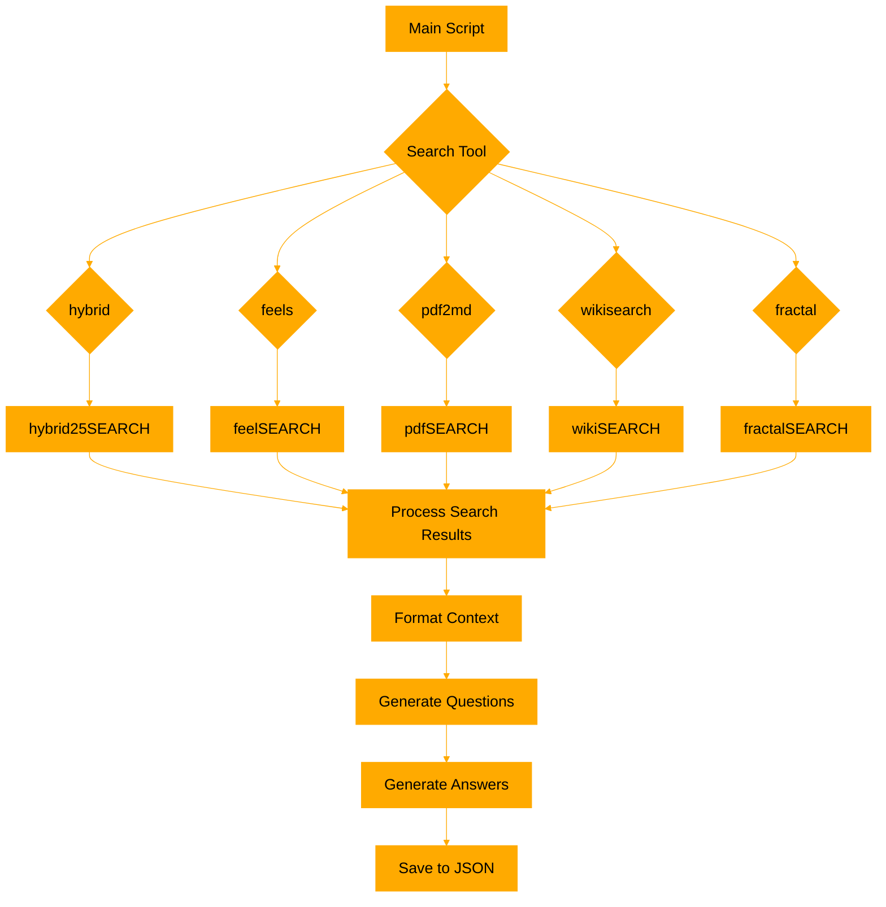
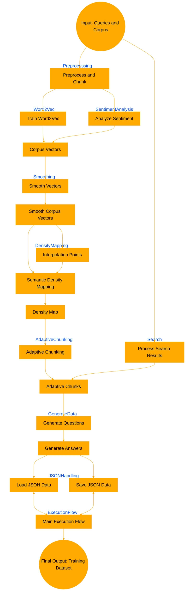

# Prophetissa
-------------

The main script acts as a central hub, orchestrating the different search methods and processing the results to generate a dataset with questions and answers.
Each search module follows its own flow for processing the input text, performing search operations, and returning relevant results. The main script then processes these results, formats the context, generates questions and answers, and saves the data to a JSON file.

This script performs a search on input data, generates context-based questions and then their answers, and saves the results in a JSON file, providing an automated way to generate a grounded dataset for finetuning. 

Prophetissa (prophetissa.py):
1. Loads the configuration and initializes the OpenAI client.
2. Defines utility functions for citation insertion, question generation, answer generation, and JSON data handling.
3. Processes search results based on the selected search tool (hybrid, feels, pdf2md, wikisearch, or fractal).
4. Formats the search results, generates questions and answers, and saves the data to a JSON file.

Search Modules:
1. feelSEARCH.py:
   - Preprocesses and chunks the input text.
   - Trains a Word2Vec model on the chunked text.
   - Performs sentiment analysis and semantic search using the trained model.
   - Adapts the chunk size based on sentiment and semantic density.

2. hybrid25SEARCH.py:
   - Splits the input text into sentences and embeds them using the Embed4All model.
   - Dynamically chunks the sentences based on the specified chunk size and threshold.
   - Performs semantic search with BM25 scoring, combining cosine similarity and BM25 scores.

3. pdfSEARCH.py:
   - Splits the input Markdown text into chunks based on pages, paragraphs, and sentences.
   - Extracts image filenames and descriptions from the Markdown.
   - Calculates keyword frequency and performs keyword search on the chunks.
   - Appends image descriptions to relevant chunks and calculates relevance scores.

4. wikiSEARCH.py:
   - Fetches Wikipedia pages based on the input query.
   - Preprocesses and chunks the page content.
   - Expands the query using TextBlob, fuzzy matching, WordNet synonyms, and named entity recognition.
   - Analyzes the sentiment and keyword frequency of the page summary.

5. fractalSEARCH.py:
   - Preprocesses and chunks the input text.
   - Trains a Word2Vec model on the chunked text.
   - Performs Mandelbrot chunking based on the query vector and model.
   - Calculates similarities between the query vector and chunk vectors.
   - Returns the top-k most similar chunks with sentiment and relevance scores.

Here's a Mermaid diagram illustrating the flow of the main script and its interaction with the search modules:



Prompts are formatted ala mistrals cookbook.
~~
```
Context information is below.
---------------------
{context_str}
---------------------
Given the context information and not prior knowledge. Generate {num_questions_per_chunk}
questions based on the context. The questions should be diverse in nature across the
document. Restrict the questions to the context information provided.
```

```
Context information is below
---------------------
{context_str}
---------------------
Given the context information and not prior knowledge,
answer the query.
Query: {generated_query_str}
Answer: 
```
[DOCS](https://docs.mistral.ai/guides/finetuning/)

judgeDREAD is a ranking script that currently just makes a bs~ rank based on the hardcoded scores extracted from the chunks. an llm will drop in here to judge (also will need 2 add scores back into json schema so I don't have to bake them and strip them)

TO RUN:
-------
```

~ensure yr seedcorpus.txt is formatted with items on new lines~

> python prophetissa.py --file_path "corpus.txt" --seed_queries_file "seedcorpus.txt" --output_file "dataset.json"

~ to rank results and create mistral compatible jsonl

> python judgeDREAD.py dataset.json --threshold 0.75

```

OUTPUT SCHEMA:
--------------
```json
[
  {
    "query": "string",
    "context": "string",
    "chunks": [
      {
        "text": "string",
        "relevance_score": "number",
        "sentiment": "number"
      }
    ],
    "combined_score": "number",
    "question": "string",
    "answer": "string"
  }
]

```
FLOW:
-----
```
+--------------------------------------------------------------------------------+
| Code Overview:                                                                 |
+--------------------------------------------------------------------------------+
|                                                                                |
| 1. Import Libraries                                                            |
|    - JSON for handling data serialization.                                     |
|    - Custom modules for search functionality and the Ollama inference API.     |
|                                                                                |
| 2. Ollama Client Initialization                                                |
|    - hijack openai api with yr local llm                                       |
|                                                                                |
| 3. Function Definitions:                                                       |
|    - generate_questions                                                        |
|      * Generates synthetic questions based on a provided context using the     |
|        Ollama inference API. Questions are designed to be diverse and relevant |
|        to the input text, enhancing dataset richness for training.             |
|                                                                                |
|    - generate_answer                                                           |
|      * For each synthetic question, generates a grounded answer using the      |
|        same context. These Q&A pairs serve as a foundational training dataset  |
|        for models requiring contextual understanding.                          |
|                                                                                |
|    - load_json_data                                                            |
|      * Loads data from a JSON file, used for appending new Q&A pairs.          |
|                                                                                |
|    - save_json_data                                                            |
|      * Serializes and saves updated Q&A pairs to a JSON file, preserving       |
|        the data for further model training.                                    |
|                                                                                |
|    - process_search_results                                                    |
|      * Utilizes a semantic search custom module to fetch relevant text chunks  |
|        from a provided corpus.                                                 |
|      * Converts these chunks into a structured context which is then used to   |
|        generate synthetic Q&A pairs, simulating realistic user interactions    |
|        and enhancing the training dataset's diversity and quality.             |
|                                                                                |
| 4. Main Execution Flow:                                                        |
|    - Reads a list of queries from a file.                                      |
|    - Each query is processed to simulate a real-world scenario where the model |
|      would need to understand and interact based on textual inputs.            |
|    - The results, including synthetic Q&A pairs, are saved to a JSON file,     |
|      ready for use in training scenarios.                                      |
|                                                                                |
+--------------------------------------------------------------------------------+
|                                                                                |
| Note:                                                                          |
| The main functionality focuses on generating synthetic data through            |
| interaction with the Ollama inference model, tailored to create a robust       |
| training dataset that mimics real-world informational needs and responses.     |
|                                                                                |
+--------------------------------------------------------------------------------+
```



DEPENDENCIES:
-------------
```
python - whatever ver. you p don't have installed
mostly useless imports i neglected to scrub

warnings
logging
numpy
sklearn
pickle
gensim
os
textblob
openai
json
```
uses fine tuning prompt template from : [mistral ft guide](https://github.com/mistralai/mistral-finetune)
uses densefeelsSEARCH for retrieval.
uses ollama for inference. 


HOW densefeelSEARCH WORKS:
-------------------------

The script provided outlines a comprehensive text analysis pipeline that integrates various natural language processing (NLP) techniques. It starts with preprocessing text, trains a Word2Vec model for semantic representation, uses sentiment analysis, performs semantic density mapping, and adapts text chunking accordingly, eventually utilizing these processed chunks for semantic search. Here’s how each component works together and influences the final search results:

1. The script reads a text file, preprocesses it by dividing the text into manageable chunks based on sentence boundaries or fallbacks to fixed word counts if no sentences are detected. This initial chunking is critical as it sets the base units of text that will be further processed and analyzed.

2. These chunks are then used to train a Word2Vec model. This model learns semantic representations of words based on their contextual usage in the chunks, producing vectors that capture the meanings of words and phrases.

3. Each chunk is analyzed for sentiment using TextBlob, which assigns a polarity score reflecting the emotional tone of the text in each chunk. This sentiment data is used later in the adaptive chunking process.

4. Parallel to sentiment analysis, the corpus vectors (derived from Word2Vec) of each chunk are used to generate a semantic density map via kernel density estimation. This map indicates areas of high and low semantic concentration across the corpus, which can guide the adaptive chunking process.

5. Chunks are then dynamically adjusted based on several factors:
- **Size constraints** (minimum and maximum sizes for chunks)
- **Sentiment shifts** (changes in sentiment that exceed a predefined threshold)
- **Semantic density changes** (fluctuations in semantic density that surpass a set threshold, derived from the density map)
This process ensures that each chunk is informationally coherent and contextually complete, which is crucial for maintaining the integrity of semantic analysis.

6. Once the adaptive chunks are finalized, a semantic search is conducted for a given query. The search leverages the Word2Vec model to find chunks that semantically align with the query by comparing vector similarities. Chunks are ranked based on their cosine similarity to the query vector, and the top results are selected based on configuration settings (top-k results).

7. n Results returned. 

Because chunks are adapted based on sentiment and semantic density, they are likely to be more topically coherent and contextually relevant. This quality directly enhances the efficacy of semantic searches since the search algorithm can operate on chunks that accurately represent distinct ideas or themes. Adaptive chunking, influenced by semantic density and sentiment, ensures that the text chunks used in the search are optimally configured to respond to the query. This leads to results that are not only relevant but also rich in contextual integrity, making them more useful for users. The inclusion of sentiment scores in the search results adds an additional layer of information, allowing users to gauge not just the relevance but also the emotional tone of the content related to their queries.

In conclusion, the integration of semantic density mapping into the adaptive chunking process significantly enhances the overall text analysis pipeline by ensuring that the chunks are both semantically and emotionally coherent. This coherence directly influences the quality of the semantic search results, making the system robust for applications requiring nuanced text understanding and retrieval.

The below graphs only sort of make sense, but opus is in cooldown for me and chatgpt can't graph for ****
```
                               +------------+
                               | Text File  |
                               +-----+------+
                                     |
                                     |
                               +-----v------+
                               | Preprocess |
                               |  & Chunk   |
                               +------------+----------+
                                                       |
                                                       |
+------------------+          +------------+           +-------------------+
| Query            |          | Semantic   |           | Train Word2Vec    |
|                  +--------->+ Search     +--------+  |                   |
| (A2)             |          | (K1)       |        |  +-------------------+
+------------------+          +------------+        |              |
                                                    v              v
                                       +-------------+------+     +--+---------------+
                                       | Analyze            |     | Corpus           |
                                       | Sentiment (D1)     |     | Vectors (E1)     |
                                       +----------+---------+     +---------+--------+
                                                  |                           |
                                                  v                           v
                                      +-----------+-----------+-+-------------+-----+
                                      | Smooth Vectors (F1)   | | Smooth            |
                                      |                       | | Corpus Vectors    |
                                      +-----------+-----------+ +---------+---------+
                                                  |                           |
                                                  v                           v
                                    +-------------+-------------+ +------------+--------------+
                                    | Interpolation              | | Semantic                  |
                                    | Points (H1)                | | Density Mapping (I1)      |
                                    +-------------+--------------+ +------------+--------------+
                                                  |                             |
                                                  |                             |
                                                  +-------------+---------------+
                                                                |
                                                                v
                                               +----------------+---------------+
                                               | Density Map (J1)               |
                                               +----------------+---------------+
                                                                |
                                                                v
                                               +----------------+--------------+
                                               | Adaptive Chunking (L1)        |
                                               +-------------------------------+
                                                                |
                                                                v
                                               +----------------+--------------+
                                               | Final Output:                 |
                                               | Search Results with Sentiment |
                                               +-------------------------------+

```
