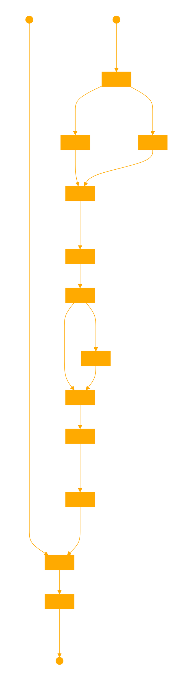

# Prophetissa
RAG dataset generator using ollama and emo vector search.
uses fine tuning prompt template from : [mistral ft guide](https://github.com/mistralai/mistral-finetune)

Uses densefeelsSEARCH

A1((Text File)) --> B1[Preprocess and Chunk]
A2((Query)) --> K1[Semantic Search]

B1 --> C1[Train Word2Vec]
B1 --> D1[Analyze Sentiment]
C1 --> E1[Corpus Vectors]
D1 --> E1
E1 --> F1[Smooth Vectors]
F1 --> G1[Smooth Corpus Vectors]

G1 --> H1[Interpolation Points]
G1 --> I1[Semantic Density Mapping]
H1 --> I1
I1 --> J1[Density Map]
J1 --> L1[Adaptive Chunking]

L1 --> K1
K1 --> M1[Search Results with Sentiment]

M1 --> N1((Final Output))

