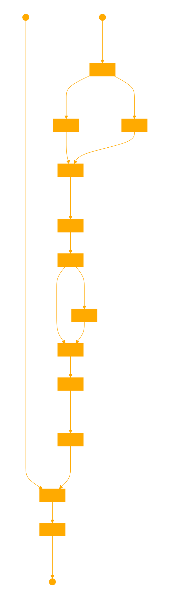

# Prophetissa
RAG dataset generator using ollama and emo vector search.
Currently only using .txt for the injests as proof of concept.

```
+--------------------------------------------------------------------------------+
| Code Overview:                                                                 |
+--------------------------------------------------------------------------------+
|                                                                                |
| 1. Import Libraries                                                            |
|    - JSON for handling data serialization.                                     |
|    - Custom modules for search functionality and the Ollama inference API.     |
|                                                                                |
| 2. Ollama Client Initialization                                                |
|    - hijack openai api with yr local llm                                       |
|                                                                                |
| 3. Function Definitions:                                                       |
|    - generate_questions                                                        |
|      * Generates synthetic questions based on a provided context using the     |
|        Ollama inference API. Questions are designed to be diverse and relevant |
|        to the input text, enhancing dataset richness for training.             |
|                                                                                |
|    - generate_answer                                                           |
|      * For each synthetic question, generates a grounded answer using the      |
|        same context. These Q&A pairs serve as a foundational training dataset  |
|        for models requiring contextual understanding.                          |
|                                                                                |
|    - load_json_data                                                            |
|      * Loads data from a JSON file, used for appending new Q&A pairs.          |
|                                                                                |
|    - save_json_data                                                            |
|      * Serializes and saves updated Q&A pairs to a JSON file, preserving       |
|        the data for further model training.                                    |
|                                                                                |
|    - process_search_results                                                    |
|      * Utilizes a semantic search custom module to fetch relevant text chunks  |
|        from a provided corpus.                                                 |
|      * Converts these chunks into a structured context which is then used to   |
|        generate synthetic Q&A pairs, simulating realistic user interactions    |
|        and enhancing the training dataset's diversity and quality.             |
|                                                                                |
| 4. Main Execution Flow:                                                        |
|    - Reads a list of queries from a file.                                      |
|    - Each query is processed to simulate a real-world scenario where the model |
|      would need to understand and interact based on textual inputs.            |
|    - The results, including synthetic Q&A pairs, are saved to a JSON file,     |
|      ready for use in training scenarios.                                      |
|                                                                                |
+--------------------------------------------------------------------------------+
|                                                                                |
| Note:                                                                          |
| The main functionality focuses on generating synthetic data through            |
| interaction with the Ollama inference model, tailored to create a robust       |
| training dataset that mimics real-world informational needs and responses.     |
|                                                                                |
+--------------------------------------------------------------------------------+
```
---

uses fine tuning prompt template from : [mistral ft guide](https://github.com/mistralai/mistral-finetune)
uses densefeelsSEARCH for retrieval.

```
                               +------------+
                               | Text File  |
                               +-----+------+
                                     |
                                     |
                               +-----v------+
                               | Preprocess |
                               |  & Chunk   |
                               +-----+------+
                                     |
                                     v
+------------------+          +-----+------+           +-------------------+
| Query            |          | Semantic   |           | Train Word2Vec    |
|                  +--------->+ Search     +--------+  |                   |
| (A2)             |          | (K1)       |        |  +-------------------+
+------------------+          +------------+        |              |
                                                      v              v
                                       +-------------+------+     +--+---------------+
                                       | Analyze            |     | Corpus           |
                                       | Sentiment (D1)     |     | Vectors (E1)     |
                                       +----------+---------+     +---------+--------+
                                                  |                           |
                                                  v                           v
                                      +-----------+-----------+ +-------------+-----+
                                      | Smooth Vectors (F1)   | | Smooth            |
                                      |                       | | Corpus Vectors    |
                                      +-----------+-----------+ +---------+--------+
                                                  |                           |
                                                  v                           v
                                    +-------------+-------------+ +------------+--------------+
                                    | Interpolation              | | Semantic                  |
                                    | Points (H1)                | | Density Mapping (I1)      |
                                    +-------------+--------------+ +------------+--------------+
                                                  |                             |
                                                  |                             |
                                                  +-------------+---------------+
                                                                |
                                                                v
                                               +----------------+---------------+
                                               | Density Map (J1)              |
                                               +----------------+---------------+
                                                                |
                                                                v
                                               +----------------+---------------+
                                               | Adaptive Chunking (L1)        |
                                               +-------------------------------+
                                                                |
                                                                v
                                               +----------------+---------------+
                                               | Final Output:                 |
                                               | Search Results with Sentiment |
                                               +-------------------------------+

```

