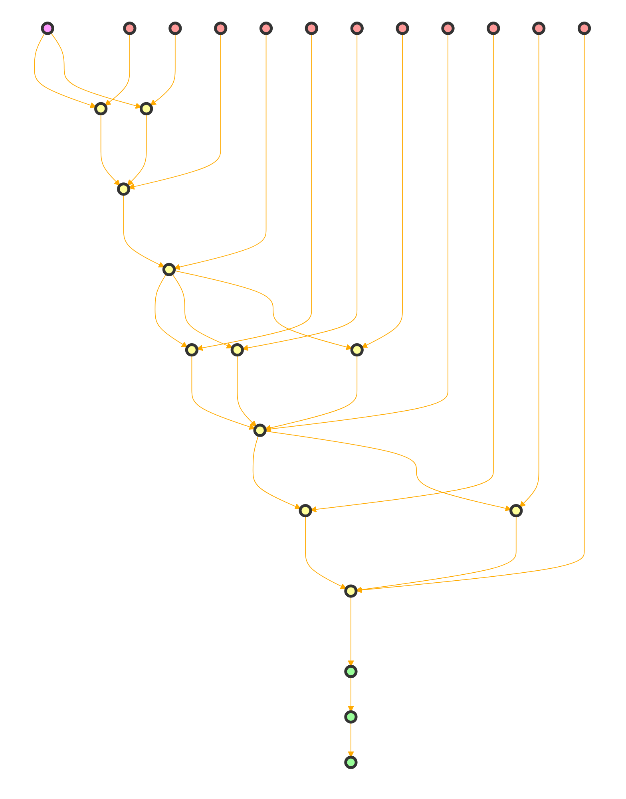

# Prophetissa
RAG dataset generator using ollama and emo vector search.
uses fine tuning prompt template from : [mistral ft guide](https://github.com/mistralai/mistral-finetune)

```mermaid
%%{init: {'theme': 'base', 'themeVariables': { 'primaryColor': '#ffaa00', 'primaryTextColor': '#ffaa00', 'primaryBorderColor': '#ffaa00', 'lineColor': '#ffaa00', 'secondaryColor': '#ffaa00', 'tertiaryColor': '#ffaa00', 'clusterBkg': 'none', 'clusterBorder': 'none', 'fontSize': '0px'}}}%%
graph TD
A((A)) --> B((B))
A((A)) --> C((C))
B((B)) --> D((D))
C((C)) --> D((D))
D((D)) --> E((E))
E((E)) --> F((F))
E((E)) --> G((G))
E((E)) --> H((H))
F((F)) --> I((I))
G((G)) --> I((I))
H((H)) --> I((I))
I((I)) --> J((J))
I((I)) --> K((K))
J((J)) --> L((L))
K((K)) --> L((L))
L((L)) --> M((M))
M((M)) --> N((N))
N((N)) --> O((O))

subgraph Input
A((A)):::input1
end

subgraph Preprocess
B((B)):::process
C((C)):::process
end

subgraph TrainWord2Vec
D((D)):::process
end

subgraph AnalyzeSentiment
E((E)):::process
end

subgraph SmoothVectors
F((F)):::process
G((G)):::process
H((H)):::process
end

subgraph SemanticSearch
I((I)):::process
end

subgraph DensityMapping
J((J)):::process
K((K)):::process
end

subgraph AdaptiveChunking
L((L)):::process
end

subgraph Output
M((M)):::output
N((N)):::output
O((O)):::output
end

subgraph "Parameter Space"
P((P)):::params --> B((B))
Q((Q)):::params --> C((C))
R((R)):::params --> D((D))
S((S)):::params --> E((E))
T((T)):::params --> F((F))
U((U)):::params --> G((G))
V((V)):::params --> H((H))
W((W)):::params --> I((I))
X((X)):::params --> J((J))
Y((Y)):::params --> K((K))
Z((Z)):::params --> L((L))
end

classDef input1 fill:#f9f,stroke:#333,stroke-width:4px;
classDef process fill:#ff9,stroke:#333,stroke-width:4px;
classDef output fill:#9f9,stroke:#333,stroke-width:4px;
classDef params fill:#f99,stroke:#333,stroke-width:4px;

```
